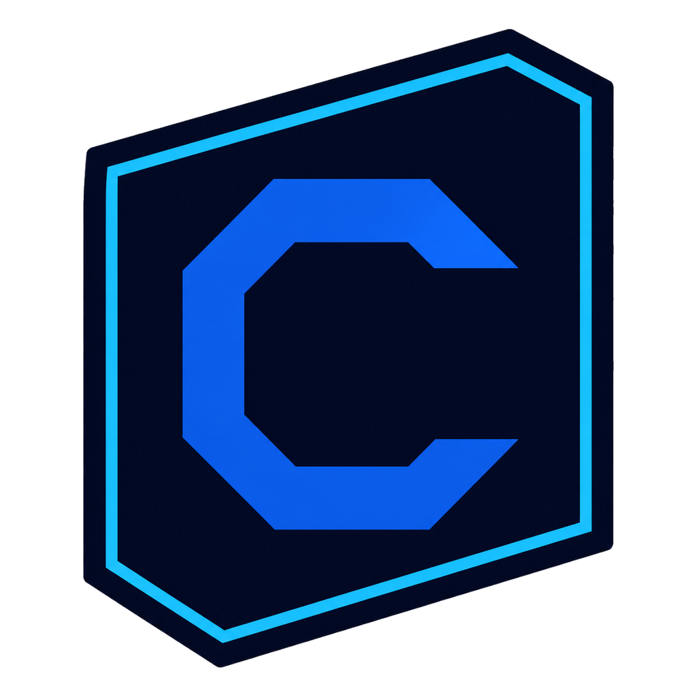

# Centurion

  

<strong>A local-first command center for orchestrating Codex agents.</strong>

  
  
  
  

Centurion is a Windows-first desktop application for defining agent roles, connecting agents visually, running bounded workflows, and inspecting every operational decision from one local workspace.

The office view is intentionally playful, but it is not the source of truth. Runs, steps, approvals, checkpoints, Codex threads, artifacts, and events are persisted locally so execution remains inspectable and recoverable.

> **Project status:** early alpha. The core vertical slice is working, but APIs and UI contracts may still evolve. Windows is the primary target.

## Why Centurion?

Centurion turns a collection of prompts into an explicit operating system for agent work:

- Define reusable agents with a role, instructions, model, reasoning effort, workspace scope, tools, and access policy.
- Connect agents, conditions, parallel branches, joins, loops, approvals, tools, and artifacts on a visual workflow canvas.
- Run workflows through the official Codex App Server over local stdio JSON-RPC.
- Use the managed ChatGPT login flow instead of putting an API key into Centurion.
- Pause on sensitive actions, enforce workspace boundaries, and keep an append-only run timeline.
- Continue after a restart using persisted checkpoints and bounded retry policies.
- Watch the office mirror real execution states without hiding the underlying text and event stream.

## Current capabilities

### Agent workbench

- Preset-based agent creation with editable role and instructions.
- Per-agent model and reasoning-effort selection from the account's dynamic Codex catalog.
- Full access and Request approval access profiles.
- Multi-select tool permissions and MCP assignment.
- Workspace-root restrictions and persistent summarized memory.
- Builder and Planning Room flows for discussing a scope before generating a workflow.

### Visual orchestration

- Drag-to-connect graph editing.
- Agent, condition, parallel, join, loop, approval, tool, and artifact nodes.
- Declarative JSON conditions; workflow expressions never execute arbitrary code.
- Bounded loops, retry limits, exponential backoff, per-node timeouts, and global run limits.
- Import/export of versioned workflow JSON.
- Save, validate, run, pause, resume, cancel, retry, and steer operations.

### Codex integration

- Local codex app-server process managed by Go.
- JSONL framing, out-of-order request correlation, notifications, server-initiated approval requests, reconnection, and clean shutdown.
- ChatGPT-managed authentication through the App Server.
- Account, plan, rate-limit, thread, turn, event, model, and MCP status surfaces.
- No OPENAI_API_KEY is required by the MVP. ChatGPT plan limits and rate limits still apply.

### Local operation

- SQLite storage under %LOCALAPPDATA%/Centurion/centurion.db with WAL mode and migrations.
- Persistent runs, steps, attempts, events, artifacts, schedules, preferences, and policy settings.
- Windows Task Scheduler integration and headless execution:

      Centurion.exe --scheduled-run <schedule-id>

- Embedded terminal and searchable history for prompts, conversations, projects, runs, and terminal actions.
- Accessible office states with text labels, visible focus, keyboard actions, high-contrast semantics, and reduced-motion support.

## Architecture

    React + TypeScript + Vite
                │ typed Wails bindings + events
                ▼
            Go application
     ┌──────────┼───────────┬───────────────┐
     │          │           │               │
    Codex    Orchestrator  Store         Scheduler
    App      executor      SQLite        Windows
    Server                 WAL           Task Scheduler
     │          │           │               │
     MCP      Agents      Security      Events / runs

The main packages are deliberately separated:

| Area | Responsibility |
| --- | --- |
| internal/codex | App Server process lifecycle, JSON-RPC, auth, threads, turns, events, models, MCP, approvals |
| internal/orchestrator | Deterministic graph validation, scheduling, branching, loops, retries, checkpoints, cancellation |
| internal/model | Versioned domain contracts and persisted settings |
| internal/store | SQLite connection, migrations, transactions, and local persistence |
| internal/security | Path validation, redaction, approval policy, and safe local boundaries |
| internal/scheduler | Windows Task Scheduler registration, single-instance coordination, and headless runs |
| internal/builder | Planning conversations and structured agent/workflow proposals |
| frontend/src | Desktop UI, workflow canvas, office view, planning room, inspector panels, and typed event handling |

## Requirements

- Windows 10 or Windows 11 for the primary desktop experience.
- Go 1.25 or newer.
- Node.js 22 or newer.
- Wails 3 CLI. This project currently targets the Wails 3 alpha toolchain.
- Codex CLI installed and available on PATH.

Centurion starts and supervises codex app-server locally. The Codex App Server owns the ChatGPT OAuth lifecycle and token storage; Centurion does not persist ChatGPT tokens directly.

## Quick start

    git clone https://github.com/RuanFernandes/centurion.git
    Set-Location centurion
    npm --prefix frontend ci
    wails3 dev

On first use, complete the ChatGPT login flow exposed by the application. The selected account determines the available models, reasoning efforts, MCP authentication, usage limits, and rate limits.

## Production build

    wails3 build

The Windows executable is written to bin/centurion.exe. The build also regenerates the Windows icon resources from build/appicon.png and embeds them into the executable.

## Verification

    go test ./...
    npm --prefix frontend ci
    npm --prefix frontend run build

For a full Windows desktop build, run wails3 build after the checks above.

## Security model

Centurion is local-first, not unrestricted:

- Agents are limited to explicitly selected workspace roots.
- Paths are normalized and checked before local file operations.
- Destructive or externally visible actions can require an explicit approval.
- MCP tools are opt-in and configurable per agent.
- Sensitive values are redacted from diagnostics and persisted events.
- Large artifacts remain files referenced by normalized path and hash instead of being copied into SQLite.
- Workflow conditions are declarative JSON expressions; arbitrary code is not evaluated by the supervisor.
- Rate limits are respected. Centurion pauses work when the App Server reports that the account cannot continue.

Never commit ChatGPT credentials, MCP secrets, environment files, local databases, or workspace-specific project data. See SECURITY.md for vulnerability reports.

## Token and context efficiency

The orchestration layer is designed to reduce avoidable context usage:

- Agent identity is stored in profiles and compact persistent memory, not repeated as raw history everywhere.
- Each run keeps operational context isolated by agent and workflow execution.
- Workflow outputs are structured so downstream nodes can consume targeted JSON instead of entire transcripts.
- Checkpoints allow recovery without blindly replaying completed steps.
- Global limits bound turns, parallelism, duration, retries, and loop iterations.
- Planning and building are separate phases so a design conversation does not automatically execute tools.

The actual usage and rate-limit behavior remains controlled by the selected Codex model and the user's ChatGPT plan.

## Contributing

Contributions are welcome. Start with CONTRIBUTING.md, read the security boundaries, and open an issue before large architectural changes.

Good first contributions include:

- Improving workflow validation and edge-case tests.
- Adding accessible states or keyboard interactions to the workflow canvas.
- Improving Codex App Server compatibility diagnostics.
- Adding migration tests and crash-recovery coverage.
- Improving documentation, examples, and Windows packaging.

## Roadmap

- Broader App Server capability compatibility across Codex CLI releases.
- More workflow node types and reusable workflow templates.
- Better run recovery diagnostics and idempotency controls.
- Signed Windows installer and release automation.
- Additional platform packaging after the Windows experience stabilizes.
- Optional provider abstractions without weakening the local-first security model.

## License

Centurion is released under the MIT License in LICENSE.

## Acknowledgements

Centurion is built with Go, Wails, React, Vite, SQLite, and the Codex App Server.
